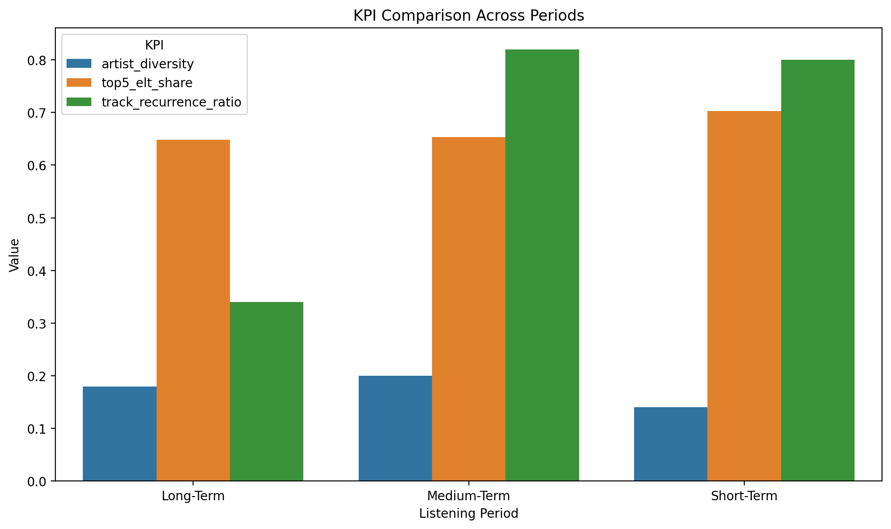
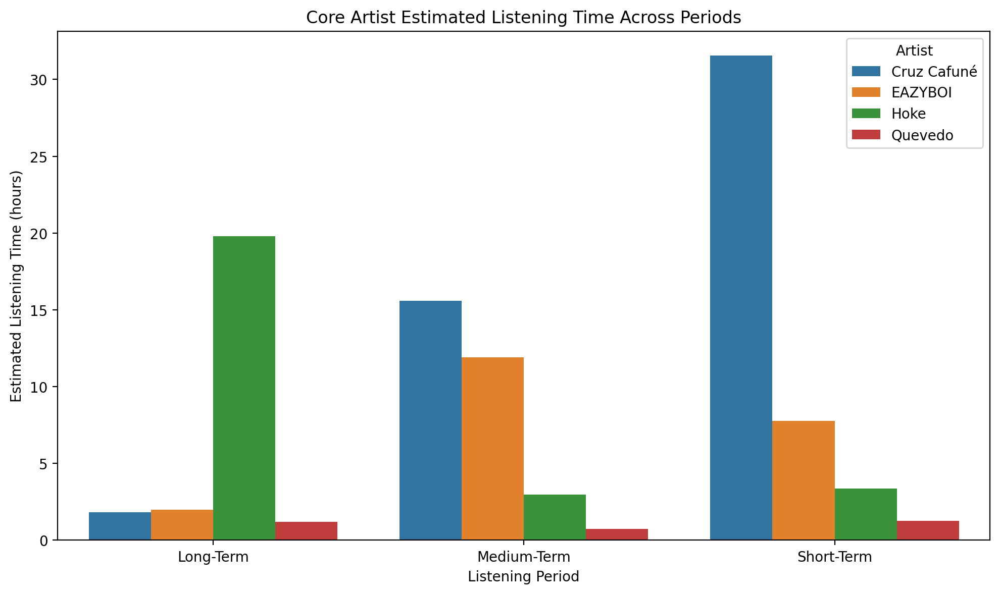
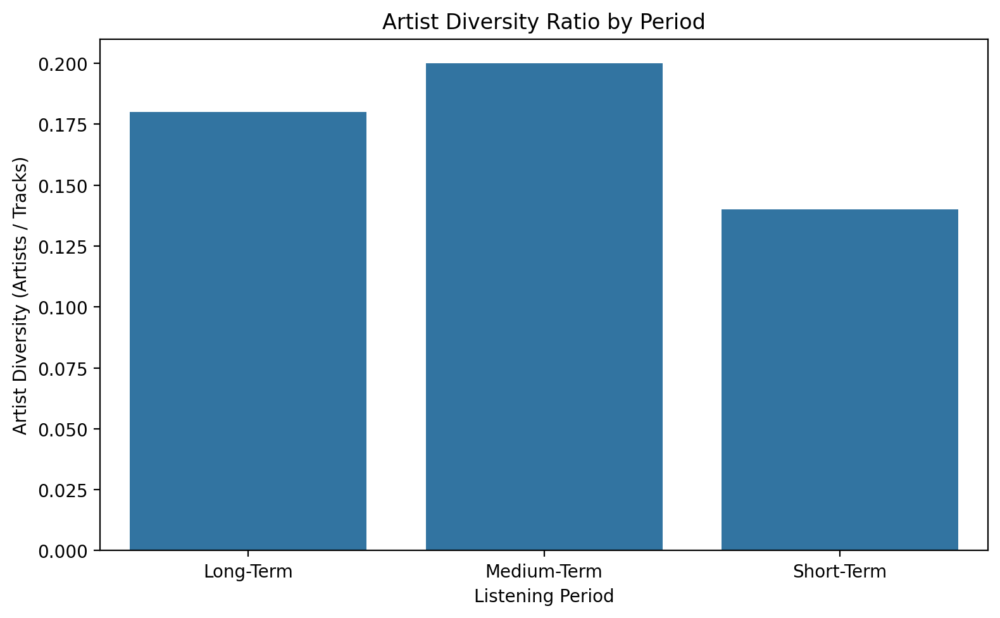
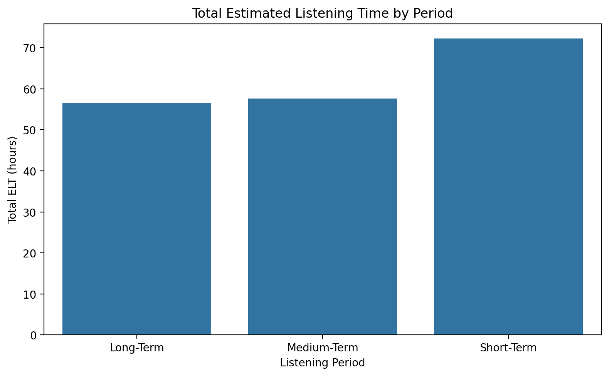

# Personal Spotify Wrapped — Data Storytelling Report

  - 1. Overview
  - 2. Listening Identity at a Glance
  - 3. Evolution Across Time Windows
  - 4. Core Artists Shaping the Profile
  - 5. Exploration vs Focus
  - 6. Key Highlights
  - 7. Final Takeaways

## 1. Overview

This report presents a data-driven summary of listening behaviour derived from a personal Spotify Wrapped analysis.  
Using multiple time windows (long-term, medium-term, and short-term), the analysis examines how musical preferences evolve, stabilize, and consolidate over time.

Rather than focusing on individual listening sessions, this report highlights structural patterns such as artist stability, diversity, listening intensity, and long-term continuity.  
All insights are grounded in quantitative metrics and comparative analysis, offering a clear overview of how preferences change across different temporal horizons.

The objective of this report is to translate analytical findings into a concise and interpretable narrative, demonstrating how behavioural data can be transformed into meaningful insights.

## 2. Listening Identity at a Glance

The long-term analysis reveals a clearly defined musical identity anchored in Spanish rap.  
Across multiple years, a stable core of artists consistently shapes listening behaviour, indicating preferences driven by meaning and continuity rather than short-term trends.

This identity is characterized by:
- A strong presence of recurring artists across all time windows  
- Low long-term artist diversity, reflecting focused and intentional listening  
- Gradual evolution rather than abrupt shifts  

While new influences appear over time, the foundational sound remains persistent, serving as the baseline against which all subsequent changes occur.

## 3. Evolution Across Time Windows

Listening behaviour evolves gradually across time windows, following a clear and structured pattern.

- **Long-Term**  
  A stable and concentrated listening profile dominated by a consistent set of core artists.

- **Medium-Term**  
  The most exploratory phase, marked by increased artist diversity and the introduction of new influences.

- **Short-Term**  
  A phase of consolidation, with higher listening intensity and stronger concentration around a refined core of artists.

Rather than abrupt changes, the data reveals a progressive transition: stability gives way to exploration, which ultimately leads to focused refinement.

This can be seen in the following figure.

## 4. Core Artists Shaping the Profile

A small group of artists consistently appears across all time windows, forming the core of the listening profile.  
These artists are not isolated peaks but recurring influences that persist despite exploration and change.

The core artist group demonstrates:
- Long-term stability across multiple listening periods  
- Sustained relevance rather than trend-driven popularity  
- A strong influence on overall listening intensity  

Their presence defines the musical baseline of the profile, while newer artists orbit around this core rather than replacing it. This balance between persistence and adaptation is a defining characteristic of the listening behaviour.

This can be seen in the following figure.

## 5. Exploration vs Focus

The analysis highlights a clear balance between exploration and focus over time.

The medium-term window represents the most exploratory phase, with higher artist diversity and broader stylistic experimentation.  
In contrast, the short-term window shows a shift toward focus, with listening concentrated around a smaller group of artists and higher overall intensity.

This pattern suggests intentional exploration followed by selective consolidation, rather than random or short-lived listening behaviour.

This can be seen in the followings figures

## 6. Key Highlights

- **Strong identity core**  
  A consistent group of artists remains influential across all time windows.

- **Peak exploration phase**  
  The medium-term period exhibits the highest diversity of artists.

- **Highest listening intensity**  
  The short-term window concentrates the largest share of listening time.

- **Progressive evolution**  
  Changes occur gradually, without abrupt disruptions in preferences.

- **Balanced listening profile**  
  Long-term stability coexists with openness to new influences.

## 7. Final Takeaways

This Spotify Wrapped analysis demonstrates how behavioural data can reveal structured patterns of stability, exploration, and refinement over time.

The listening profile is defined by a strong and persistent core, complemented by periods of exploration that lead to focused consolidation rather than fragmentation.  
Overall, the data reflects a consistent identity that evolves deliberately, integrating new influences while preserving long-term preferences.
